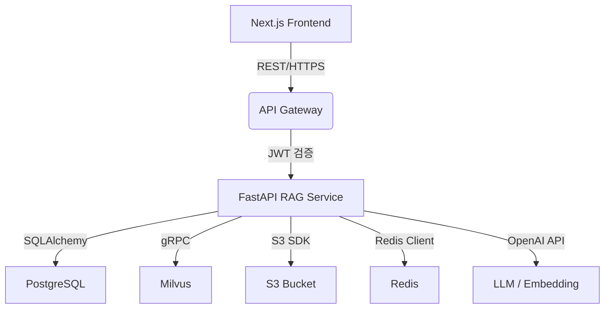

# 기술 요구사항 문서 (TRD)

## 1. 기술 총괄 요약

- 프로젝트 개요
  - RAG 기반 문서 검색 웹서비스로, 산업 현장 매뉴얼·도면·계약서에 대해 근거 포함 Q&A를 제공
- 핵심 기술 스택
  - Frontend: React + Next.js(SSR)
  - Backend: Python FastAPI 마이크로서비스
  - 저장소: PostgreSQL (메타데이터), Milvus 또는 Pinecone(벡터), AWS S3(문서)
- 주요 기술 목표
  - 평균 응답 ≤ 3 초 / p95 ≤ 5 초
  - 99.9 % 가용성, 동시 접속 10 000명 대응
  - Top-3 정답 포함률 ≥ 85 %
- 핵심 전제
  - 클라우드 우선(AWS), 컨테이너 기반(Kubernetes)
  - GPT-4o 우선, 로컬 Instructor-XL 백업
  - 예산 최적화를 위해 호출량·모델 선택을 하이브리드로 관리

## 2. 기술 스택

| Category          | Technology / Library          | Reasoning (선정 이유)                                 |
| ----------------- | ----------------------------- | ----------------------------------------------------- |
| Frontend          | React + Next.js (SSR)         | SEO·초기 로딩 최적, CSR·SSR 혼합 가능                 |
| 상태 관리         | React Context + SWR           | 단순 캐싱·페칭에 충분, 외부 라이브러리 최소화         |
| Styling           | Tailwind CSS                  | 생산성·일관된 디자인 시스템, 러닝커브 낮음            |
| Backend Framework | Python FastAPI                | 비동기 지원, OpenAPI 문서 자동화, 경량 마이크로서비스 |
| Runtime           | Python 3.11                   | 성능 개선, 보안 패치 최신                             |
| Relational DB     | PostgreSQL (AWS RDS)          | 트랜잭션 강력, JSONB 지원, 커뮤니티·관리 용이         |
| Vector DB         | Milvus (stand-alone)          | 오픈소스, 자체 호스팅, 비용 절감, kNN 성능 우수       |
| Object Storage    | AWS S3                        | 대용량 문서 저장, 버전 관리, 내구성 11 9's            |
| Embedding Model   | OpenAI text-embedding-3       | 정확도·호환성 우수, 벤더 잠김 완화 위해 로컬 fallback |
| LLM               | OpenAI GPT-4o / Llama2-70B    | 품질-비용 균형, 하이브리드 선택                       |
| Authentication    | OAuth2.0 + JWT                | 소셜 로그인·API 인증 통합                             |
| Deployment        | Docker + Kubernetes (AWS EKS) | 오토스케일·롤링업데이트, 팀 친숙                      |
| CI/CD             | GitHub Actions                | 클라우드 네이티브, 설정 단순                          |
| Monitoring        | Prometheus + Grafana, Sentry  | 메트릭·로그·에러 통합 관측                            |
| Caching           | Redis (AWS ElastiCache)       | 세션·쿼리 캐시, API 응답 지연 최소화                  |
| OCR (Phase 2)     | Tesseract + pytesseract       | 오픈소스, 기본 한글 지원, 비용 無                     |
| Notification      | AWS SES + Slack Webhook       | 이메일·팀 알림 통합                                   |

## 3. 시스템 아키텍처 설계

### 최상위 빌딩 블록

- Frontend
  - Next.js SSR, Tailwind UI, OAuth2 연동
- API Gateway
  - AWS API Gateway, 인증·레이어7 라우팅
- RAG Service (FastAPI)
  - 업로드, 임베딩, 검색, LLM 프롬프트 조합
- Vector Store
  - Milvus 클러스터, Top-k 검색
- Metadata Store
  - PostgreSQL: 유저·문서·권한·로그
- Object Storage
  - S3: 원본 파일, 파싱 결과, 버전 관리
- Caching Layer
  - Redis: 단기 세션·쿼리 캐싱
- Monitoring Stack
  - Prometheus, Grafana, Sentry

### 상호작용 다이어그램



- 프론트엔드는 HTTPS REST로 API Gateway에 요청, JWT 포함
- API Gateway는 FastAPI로 라우팅, 권한·쿼터 검사
- FastAPI 서비스는 Milvus에서 근접 벡터 검색 후 LLM 호출
- 문서·메타데이터는 S3·PostgreSQL에 저장, Redis로 캐시

### 코드 조직 & 컨벤션

도메인 기반 모듈화를 적용한다.

```
/
├── frontend/
│   ├── components/
│   ├── pages/
│   ├── hooks/
│   └── styles/
├── backend/
│   ├── app/
│   │   ├── api/           # REST 엔드포인트
│   │   ├── domain/
│   │   │   ├── documents/ # 업로드·파싱·버전
│   │   │   ├── search/    # 임베딩·RAG
│   │   │   └── users/     # 인증·권한
│   │   ├── core/          # 설정, 로깅, 예외
│   │   ├── services/      # 외부 API 클라이언트
│   │   └── models/        # Pydantic 스키마
│   └── tests/
├── infra/
│   ├── k8s/               # Helm 차트
│   ├── terraform/         # AWS 리소스
│   └── github-actions/
└── docs/
```

### 데이터 흐름 & 통신 패턴

- 클라이언트 ↔ 서버: JSON REST, OAuth2 Bearer JWT
- DB 접근: SQLAlchemy ORM, 연결 풀 관리
- 외부 API: 비동기 HTTPx, 재시도·타임아웃 공통 Wrapper
- 실시간 필요 시: SSE를 통한 업로드 진행률 전송
- 데이터 일관성: 단일 작성 원칙(PostgreSQL), 캐시 무효화 패턴 적용

## 4. 성능 최적화 전략

- 임베딩·LLM 요청을 비동기 배치 처리, 큐(내장 Celery)로 슬로우 태스크 분리
- Redis 캐시로 빈번 질문·최근 문서 검색 결과 TTL 5분 저장
- Milvus IVF_FLAT + HNSW 인덱스 설정으로 벡터 검색 지연 최소화
- Next.js SSR 페이지를 CloudFront로 캐싱하여 초기 로딩 가속

## 5. 구현 로드맵 & 마일스톤

### Phase 1: 기반(MVP) – M1~M2

- Kubernetes 클러스터, CI/CD 파이프라인 구축
- 문서 업로드·임베딩·검색·RAG Q&A 핵심 기능
- OAuth2 소셜 로그인, JWT 발급
- 기본 모니터링(Grafana 대시보드)
- 베타 릴리스 준비

### Phase 2: 기능 확장 – M3~M4

- 권한(Role)·문서 분류·OCR 기능 통합
- 변경 이력 저장 및 요약 생성
- 캐싱·쿼리 최적화로 p95 지연 20 % 감소
- 알림(이메일·Slack) 및 오답 리포트 UI 추가
- 베타 → GA 출시

### Phase 3: 스케일링 & 최적화 – M5~M6

- 오토스케일 파라미터 튜닝, HPA 적용
- Agent 태스크(복합 질문)·일정 리마인더 기능
- GDPR·내부 감사 로그, 취약점 스캐닝 자동화
- 비용 리포트 대시보드, 티어별 모델 사용 정책

## 6. 위험 평가 및 대응 전략

### 기술 리스크

- 모델 정확도 저하 → 도메인 파인튜닝·휴먼 검증 워크플로 추가
- 벡터 검색 병목 → Milvus 샤딩·인덱스 파라미터 최적화
- S3 대용량 업로드 지연 → 멀티파트 업로드·프리사인 URL 적용
- 외부 LLM 장애 → 로컬 Llama2 Fallback, 캐시된 응답 활용

### 프로젝트 전달 리스크

- 일정 지연 → 기능 우선순위 조정, 주간 버너다운 추적
- 인력 부족 → 외주 QA 활용, 핵심 모듈 코드 리뷰 강화
- 품질 저하 → 테스트 커버리지 70 % 이상, PR 템플릿 의무화
- 배포 실패 → Blue-Green 배포, 즉시 롤백 스크립트 준비

---
